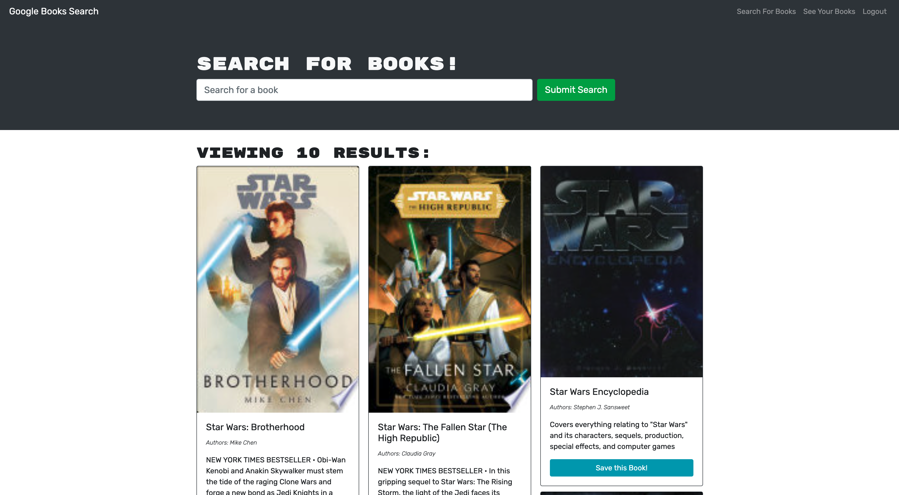
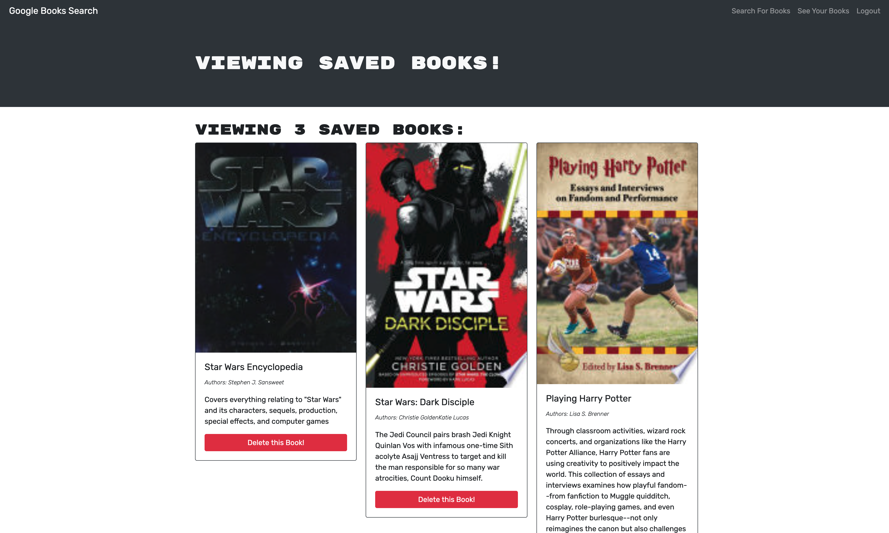

# Google Book Search Engine - MERN Project


## Link

**Please click [here](https://damp-inlet-30555.herokuapp.com/) to find the deployed application in Heroku**

## Description

The Google Book Search Engine is a full stack application that is functioning with GraphQL API and Apollo Server. The app was built using the MERN stack with a React front end, MongoDB database, and Node.js/Express.js server and API. It allows users to signup/login the application, search books online, add or remove books with the user account.

## Table of Contents

- [Link](#link)
- [Description](#description)
- [Usage](#usage)
- [Technologies](#technologies)
- [Credits](#credits)
- [Assets](#assets)
- [License](#license)

## Usage

Please follow the usage instruction here:
- Open the application from the Heroku deployed link
- Type in keywords to search books in the application
- Login/Signup the application
- Users can add books or remove books after logging in the account

## Technologies

```md
JavaScript
HTML
CSS
React
MongoDB database
Express.js
Node.js
GraphQL
Apollo Server
Google Books API
```

## Credits

The starter code is provided by The Coding Boot Camp | UC San Diego Extension | Trilogy Education Services, LLC

## Assets

The following images demonstrate the **Google Book Search Engine** application's functionality:






## License

Copyright (c) 2022 Elaine Qiling Deng. This project is licensed under the terms of the [MIT license](LICENSE).